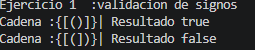
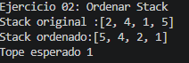
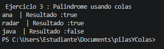

# Práctica: Pilas y Colas

## Datos del Estudiante
- **Nombre:** Jorda Sagbay
- **Curso:** grupo 3 
- **Fecha:** 10/06/2026

---
## Descripcion general.
Crear diferentes metodo para resolver los problemas propuestas para esta prectica utilizando pilas y colas.
## 1. Ejercicio 01.

**Descripción:**
crear un metodo signValidator para verificar si las llaves de parametros esta iguales o si no se cierran.


![Captura de salida en consola] 


### Captura del código de implementación del ejercicio 1

```java
 public boolean isValid(String s) {
        Stack<Character> stack = new Stack<>();

        for (char c : s.toCharArray()) {

            if (c == '(' || c == '{' || c == '[') {
                stack.push(c);
            } else {
                if (stack.isEmpty()) {
                    return false;
                }

                char top = stack.pop();

                if ((c == ')' && top != '(') ||
                    (c == '}' && top != '{') ||
                    (c == ']' && top != '[')) {
                    return false;
                }
            }
        }

        return stack.isEmpty();
    }

```


## 2. Ejercicio De ordenar numeros

**Descripción:**
Ordenar un arreglo de numeros usando pilas y colas.

![Captura de salida en consola] 

.......

### Método implementado

```java
public void sortStack(Stack<Integer> stack) {

        Stack<Integer> aux = new Stack<>();

        while (!stack.isEmpty()) {

            int temp = stack.pop();

            while (!aux.isEmpty() && aux.peek() > temp) {
                stack.push(aux.pop());
            }

            aux.push(temp);
        }

        while (!aux.isEmpty()) {
            stack.push(aux.pop());
        }
    }

```
## 3. Palabra palindrome

**Descripción:**
creamos un metodo para saber si una palabra es palindromo usando pilas 

![Captura de salida en consola] 

.......

### Método implementado

```java
public boolean isPalindrome(String text) {

        Queue<Character> q1 = new LinkedList<>();
        Queue<Character> q2 = new LinkedList<>();

        for (char c : text.toCharArray()) {
            q1.offer(c);
        }

        for (int i = text.length() - 1; i >= 0; i--) {
            q2.offer(text.charAt(i));
        }

        while (!q1.isEmpty()) {
            if (!q1.poll().equals(q2.poll())) {
                return false;
            }
        }

        return true;
    }

```

